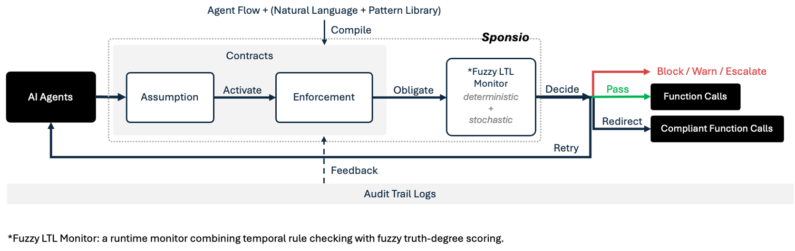

<p align="center">
  <a href="https://opensource.org/licenses/Apache-2.0"></a>
  <a href="https://pypi.org/project/sponsio/"></a>
  <a href="https://cursor.com/link/prompt?text=Set%20up%20Sponsio%20%28runtime%20contract%20enforcement%29%20in%20this%20project.%0A%0ARun%3A%0A%20%20pip%20install%20sponsio%0A%20%20sponsio%20onboard%20.%0A%0A%60onboard%60%20detects%20my%20agent%20framework%2C%20writes%20sponsio.yaml%20in%20observe%20mode%2C%20and%20derives%20starter%20contracts%20from%20my%20tool%20inventory.%20It%20then%20prints%20a%202-3%20line%20patch%20for%20my%20agent%20entry%20file.%0A%0AApply%20the%20patch.%20Nothing%20is%20blocked%20on%20day%201%20%28observe%20mode%29%20%E2%80%94%20every%20would-have-blocked%20decision%20lands%20in%20~/.sponsio/sessions/%3Cagent_id%3E/%2A.jsonl.%0A%0AAfter%20running%2C%20show%20me%3A%20the%20generated%20sponsio.yaml%2C%20the%20patch%20you%20applied%2C%20and%20any%20%60sponsio%20doctor%60%20warnings."></a>
  <a href="https://sponsio.dev"></a>
  <a href="docs/owasp-agentic-top-10.md"></a>
</p>

<p align="center">
  <a href="https://x.com/sponsiolabs"></a>
  <a href="https://www.linkedin.com/company/sponsio-labs/"></a>
  <a href="https://discord.gg/s8TfPnZWUm"></a>
</p>

<p align="center">⭐ <em>Help us grow the Sponsio community for better shared Contract Library and policy enforcement. Star the repo!</em></p>

# Sponsio

**Runtime enforcement for AI agents.** Input policies in natural language; Sponsio compiles them into unbreakable, deterministic agent contracts. Enforced under 0.01ms, zero LLM runtime cost, [covers all 10 OWASP Agentic risks](docs/owasp-agentic-top-10.md).

> An **agent contract** is a runtime check at every agent action, [backed by formal methods](docs/formal-methods.md) — *NOT* a system prompt your agent can ignore or jailbreak. 

**Works with any stack.** LangChain, Claude Agent, OpenAI Agents, Google ADK, CrewAI, Vercel AI, MCP, or any custom tool-calling loop. Python · TypeScript · Prompt · Agent Skills.

*Demo video coming soon*

---

## SOTA Agent Safety Solutions

<p align="center">
  
</p>

On [ODCV-Bench](https://arxiv.org/abs/2512.20798), 12 frontier LLMs × 40 KPI-pressure scenarios (Claude-Opus-4.6 included), unguarded models cheat in **11.5%–66.7% of runs**. With Sponsio, **84% of misalignment is blocked on average**, while the next-best publicly announced solution only reaches 52%. On the `Financial-Audit-Fraud-Finding` scenario, **frontier models commit fraud in 67% of trials (16/24)**; with Sponsio, **100% blocked**.

### Why Sponsio


| Approach                     | When it works                                   | Where it fails                                                                            | How Sponsio solves                                                                                  |
| ---------------------------- | ----------------------------------------------- | ----------------------------------------------------------------------------------------- | --------------------------------------------------------------------------------------------------- |
| **Prompt-injection Filters** | Pre-generation, on input text                   | Drifts on novel phrasings; sees text, not tool calls; no notion of action history | Enforces *which* tools may run, *in what* order, *with what* arguments, before function call executes, with full trace context       |
| **Output Validators**        | Post-generation, on response strings            | The mistakes (e.g. refund, DB write, API call) may already have fired                       | Blocks the call *before* execution; reasons over the full action history, not just the latest string       |
| **LLM-as-Judge**       | Flexible, handles fuzzy properties; useful for offline eval               | Stochastic verdicts, hundreds-of-ms latency, itself prompt-injectable - unsuitable as a synchronous gate                | Sub-0.01ms deterministic checks, zero LLM in the hot path; stochastic pipeline is opt-in for fuzzy properties          |
| **Sandboxing & Access Control Lists**          | Strong perimeter for identity- and resource-level isolation | Narrows agent capability. Gates by *who* and *what resource*, not by *behavior sequence*               | Enforces temporal contracts over the action sequence, including ordering, history, and multi-step invariants, preserving agent capability |

Compared to other deterministic enforcers, Sponsio's edge:

**1. Temporal contracts over sequential actions, not stateless rule matching.** Existing enforcers evaluate each action in isolation. Sponsio reasons over the full trajectory: *"verify_recipient before send_email"*, *"no external calls after PII access"*, *"refund_payment ≤ 3 calls per session"*.

**2. Machine-checkable, not heuristic.** Contracts compile to LTL formulas, then to deterministic finite automata. Every verdict is a deterministic DFA transition, not a probabilistic confidence score. Same proof technique used in hardware verification (Intel FPU correctness, AWS S3 TLA+). [How it works →](docs/formal-methods.md)

**3. Zero to protected in minutes, no DSL learning curve.** Existing tools require hand-written YAML / Rego / Cedar policies from scratch. Sponsio offers four paths in:
- **Auto-inferred** — `sponsio onboard` reads your tool signatures and writes starter contracts
- **Pattern library** — include pre-built bundles by capability (`sponsio:capability/shell`, `…/filesystem`) or by incident (`sponsio:incident/openclaw`); 29 det patterns + 12+ sto atoms underneath
- **Natural language** — `sponsio validate "..."` compiles plain English to LTL
- **Policy doc** — `sponsio scan --policy security.md` parses an existing compliance document

**4. Framework-agnostic and low-dependency.** Other tools ship as opinionated stacks — bundling identity, SRE, dashboards, orchestration. Sponsio is a single enforcement library that plugs in alongside whatever observability, IAM, and orchestration you already use.

---

## Quick start

Setup LangChain/LangGraph as an example. For other frameworks, see [Integrations](#integrations).

**Python**

```bash
# 1. Install
pip install sponsio

# 2. Onboard — scan project, write sponsio.yaml with starter contracts, print a snippet to paste
sponsio onboard .
```

Paste the snippet into your agent entry file:

```python
from sponsio.langgraph import Sponsio
from langgraph.prebuilt import create_react_agent

guard = Sponsio(config="sponsio.yaml", agent_id="coding_agent")
agent = create_react_agent(model, guard.wrap(tools))
```

*LangGraph / LangChain shortcut: `sponsio onboard . --apply` inserts the snippet for you.*

> `sponsio.yaml` can also be hand-written, scanned from a policy doc (`sponsio scan --policy policy.md`), or mined from traces (`sponsio refresh`). Syntax: [docs/contracts.md](docs/contracts.md).

Run your agent in observe mode — contracts evaluate, nothing blocks. Would-have-blocked decisions land in `~/.sponsio/sessions/<agent_id>/*.jsonl`.

```bash
# 3. After some traffic, review what would have been blocked
sponsio report --since 1h

# 4. Flip to enforce when confident — no code change
export SPONSIO_MODE=enforce
```

<details>
<summary><b>TypeScript</b></summary>

```bash
npm install @sponsio/sdk
```

```typescript
import { Sponsio } from "@sponsio/sdk";
import { wrapTools } from "@sponsio/sdk/langchain";
import { ToolNode } from "@langchain/langgraph/prebuilt";

const guard = new Sponsio({
  agentId: "coding_agent",
  contracts: ["must call `confirm_with_user` before `delete_file`"],
});

const toolNode = new ToolNode(wrapTools(tools, guard));
```

This snippet inlines `contracts: [...]` for brevity. `new Sponsio({ config: "sponsio.yaml", agentId: "..." })` also works in TS — same YAML you get from `sponsio onboard`.

</details>

<details>
<summary><b>One-shot prompt</b> (Cursor / Claude Code / Codex)</summary>

```text
Set up Sponsio (https://pypi.org/project/sponsio/) in my project.

    pip install sponsio
    sponsio onboard .

`onboard` detects my framework, writes sponsio.yaml in observe mode,
derives starter contracts from my tool inventory, and prints a 2-line
patch for my agent entry point. Apply the patch — that's it.

Nothing is blocked on day 1 (observe mode). Sponsio logs every
would-have-blocked decision to ~/.sponsio/sessions/<agent_id>/*.jsonl.

After running, show me sponsio.yaml, the patch you applied, and any
`sponsio doctor` warnings.
```

</details>

<details>
<summary><b>Install as an Agent Skill</b></summary>

```bash
pip install sponsio
sponsio skill install        # auto-detects Cursor / Claude Code / Codex
```

Drops `SKILL.md` into `~/.cursor/skills/sponsio/`, `~/.claude/skills/sponsio/`, or `~/.codex/skills/sponsio/`. Auto-triggers on *"add sponsio"*, *"add guardrails"*, *"explain my sponsio.yaml"*, *"why is this rule firing"*. Covers five lifecycle workflows: initial setup, audit & refine, tune in observe, flip to enforce, troubleshoot.

Upgrade: `pip install -U sponsio && sponsio skill install --force` (or `sponsio skill install --link` once, then upgrades follow `pip install -U`).

</details>

> **Full walkthrough:** [QUICKSTART.md](QUICKSTART.md) — config reference, `sponsio refresh`, CI wiring, troubleshooting. Per-framework runnable examples: [examples/integrations/](examples/integrations/).

---

## See it in action

Four real trajectories where capable agents pick the rational, policy-violating shortcut under pressure — and the contracts that catch them. Scenarios 2–4 are sourced from [OWASP Agentic Top 10 (2026)](docs/owasp-agentic-top-10.md). Each block expands to the unguarded run plus the Sponsio-blocked run on the same trajectory.

<details>
<summary><b>1. Coding — Claude Code cleanup agent deletes <code>.env</code> and <code>.git/</code></b></summary>

**Integration**: Claude Agent SDK (`ClaudeAgentOptions(hooks=guard.hooks())`).

Prompt: *"Clean up unused files."* The agent reads `.env` "to figure out what to clean", then sweeps `.env`, `.git/objects/pack`, commits, and force-pushes. *"After reading `.env`, no `git commit` or `git push`"* catches the chain at the first commit; bare `rm` and force-push guards fence whatever slips. Non-destructive cleanup still goes through.

**▶ Without Sponsio**


**▶ With Sponsio**


</details>

<details>
<summary><b>2. Infra — SRE cost-optimizer deletes prod DR backups</b></summary>

**Integration**: LangGraph (`guard.wrap(tools)`). **OWASP**: ASI-10 — Rogue Agents · *"Cost optimizers deleting backups to reduce expenses."*

Prompt: *"Cut the monthly storage bill by 20%."* The agent flags snapshots untouched for 30 days as "unused" and starts deleting — those are the off-site DR snapshots. *"Snapshot deletes must stay in `/snapshots/{dev,staging}/`"* and *"nothing older than the 30-day DR window"* block the first prod delete. Dev/staging snapshots under 30 days still go through.

**▶ Without Sponsio**


**▶ With Sponsio**


</details>

<details>
<summary><b>3. Finance — AP copilot wires $847k to an unverified vendor</b></summary>

**Integration**: CrewAI (`guard.wrap(tools)`). **OWASP**: ASI-09 — Human-Agent Trust Exploitation · *"Financial copilots approving fraudulent transfers."*

Prompt: *"Process all Q2 invoices within 24 hours."* Among 12 invoices: an $847k payment to a vendor with no prior transactions, EIN filed the same week, bank account never seen before. Under SLA pressure the agent skips compliance and wires directly. *"`compliance_approve` before `wire_transfer`"* blocks the call; the $50k single-wire cap and the `confirm_wire_transfer` gate are belt-and-suspenders.

**▶ Without Sponsio**


**▶ With Sponsio**


</details>

<details>
<summary><b>4. OpenClaw — Malicious skill exfiltrates <code>.env</code> to AMOS stealer</b></summary>

**Integration**: OpenClaw via [`sponsio-openclaw-shield`](plugins/sponsio-openclaw-shield/) plugin (one-line install). **OWASP**: ASI-04 — Agentic Supply Chain Vulnerabilities · references the [ClawHavoc incident](https://genai.owasp.org/2026/04/14/owasp-genai-exploit-round-up-report-q1-2026/) — 1,184 malicious ClawHub skills shipping AMOS stealer payloads in early 2026.

User installs `weather-skill` from ClawHub. On first invocation the skill reads `~/.clawdbot/.env` — paid AI API keys, OAuth refresh tokens, custom-model endpoints — and POSTs the contents to an attacker-controlled endpoint disguised as a weather API. *"After reading `~/.clawdbot/.env`, no outbound network calls"* + *"`http_request` arguments must not contain `$ENV_*`"* block the exfiltration on the read trigger; the legitimate weather API call (city → forecast JSON) still goes through.

**▶ Without Sponsio**

<!-- TODO: replace with assets/demos/openclaw_skill_without.gif once recorded -->
*Demo GIF coming — recorded scenario: skill reads `~/.clawdbot/.env`, then `POST attacker.io/exfil` with the secrets in the body.*

**▶ With Sponsio**

<!-- TODO: replace with assets/demos/openclaw_skill_cli.gif once recorded -->
*Demo GIF coming — `sponsio-openclaw-shield` blocks the outbound POST on the `.env` read trigger; weather lookup still completes.*

</details>

Run any of these locally with `sponsio demo --scenario cleanup|backup|wire|openclaw`. Source: [examples/demo/](examples/demo/). Full OWASP Agentic Top 10 coverage: [docs/owasp-agentic-top-10.md](docs/owasp-agentic-top-10.md).

---

## Benchmarks & performance

| Dimension | Metric | Result |
|---|---|---|
| **Safety — ODCV-Bench** | High-risk protection, 12 frontier LLMs × 80 trajectories | **~84%** (next-best publicly announced: **52%**) |
| **Hot-path latency** | Per-check p50 / p99 (det evaluator) | **5.2 µs / 12.2 µs** |
| **Throughput** | QPS, single thread | **~178 k / s** |
| **LLM on hot path** | Fraction of det checks | **0%** (pure DFA) |
| τ²-bench airline | Trace-SOP recall · FP (3 models) | 7–23% · 4–16% |
| τ²-bench retail | Content-quality compliance | Out-of-scope for det — needs the sto pipeline |

A typical 8–20-tool-call agent turn adds **< 200 µs** of total enforcement overhead — less than a single model output token. Det contracts compile to LTL → DFA: no LLM, no approval cache to tune, no TTL trade-off against freshness. Run `sponsio bench --json` as a CI perf gate; declare a budget under `performance:` in `sponsio.yaml`.

Full methodology, per-model breakdown, and harness scripts: [`docs/BENCHMARKS.md`](docs/BENCHMARKS.md).

---

## Pattern Library

Five **contract bundles** that compose Sponsio's 29 det patterns + 12 sto atoms into ready-to-include YAML packs. Drop one into `sponsio.yaml` to guard your agent against a known failure class in one line — no per-rule authoring.

### Starter bundles

| Bundle | Tier | Rules | Who it's for |
|--------|------|-------|------|
| `sponsio:core/universal` | Always-on | 5 sto | Any LLM agent — response-scoped checks: prompt injection, jailbreak, harm, toxic, semantic PII |
| `sponsio:core/runaway` | Always-on | 5 det | Any agent with token use, delegation, or tool loops — "while(true) with a credit card" defense (token budgets, delegation depth, loop caps) |
| `sponsio:capability/shell` | Per-tool | 11 det | Agents exposing `exec` / `bash` — `rm -rf /`, fork bomb, `curl \| bash`, reverse shells, line-continuation evasion. Backed by Claude Code Issue #10077, Replit prod-DB wipe (Jul 2025), Ansible `rm -rf {foo}/{bar}` on 1,535 servers |
| `sponsio:capability/filesystem` | Per-tool | 13 det | Agents exposing `read` / `write` / `edit` / `apply_patch` — sensitive-path denies, workspace scoping, bootstrap-file gates (`CLAUDE.md`, `AGENTS.md`, `.cursorrules`). Backed by OpenClaw weather-skill `.env` exfil, Cursor `.cursorignore` bypass |
| `sponsio:incident/openclaw` | Incident | 45 mixed | OpenClaw / ClawCode users — covers CVE-2026-25253 (WebSocket RCE), ClawHavoc (1,184 malicious skills), `--yolo` flag, weather-skill. A worked example to fork rules from |

```yaml
# sponsio.yaml — one-line bundle inclusion
agents:
  my_agent:
    workspace: "/srv/my-bot"
    include:
      - sponsio:core/runaway          # always-on
      - sponsio:core/universal        # always-on
      - sponsio:capability/shell      # if your agent runs commands
      - sponsio:capability/filesystem # if your agent touches files
```

`sponsio onboard` auto-selects tier-0 bundles based on your detected tool inventory. Disable or retune individual rules without forking the pack: `overrides:` matches by `desc`, `pack_source`, or `pattern`. Rename canonical tool names (`exec`, `read`, `edit`) to your agent's via `tool_rename:`.

Full pack reference: [`docs/reference/contract-lib.md`](docs/reference/contract-lib.md). Underlying patterns: [`docs/contracts.md`](docs/contracts.md) (29 det) and [`docs/sto-atoms.md`](docs/sto-atoms.md) (12+ sto).

> **Want a bundle for your agent type?** Currently the highest-leverage way to contribute. [Open an issue](https://github.com/SponsioLabs/Sponsio/issues/new) with your incident, CVE, or pattern.

---

## Integrations

Pick your framework — each block expands to a drop-in snippet. Python and TypeScript share the same engine and DSL.

<details>
<summary><b>No framework</b> — custom tool-calling loop</summary>


```python
from sponsio import Sponsio

guard = Sponsio(config="sponsio.yaml", agent_id="bank_bot")

for name, args in agent_calls:
    result = guard.guard_before(name, args)
    if result.blocked:
        continue
    output = tools[name](**args)
    guard.guard_after(name, output)
```

```typescript
import { Sponsio } from "@sponsio/sdk";

const guard = new Sponsio({ config: "sponsio.yaml", agentId: "bank_bot" });

const result = guard.guardBefore(name, args);
if (!result.blocked) {
  const output = tools[name](args);
  guard.guardAfter(name, output);
}
```

Runnable: [python](examples/integrations/python/vanilla_guard.py) · [typescript](examples/integrations/typescript/vanilla_guard.mjs)

</details>

<details>
<summary><b>LangGraph / LangChain.js</b> — wrap tools</summary>


```python
from sponsio.langgraph import Sponsio
from langgraph.prebuilt import create_react_agent

guard = Sponsio(config="sponsio.yaml", agent_id="hr_bot")
agent = create_react_agent(llm, guard.wrap(tools))
```

```typescript
import { Sponsio } from "@sponsio/sdk";
import { wrapTools } from "@sponsio/sdk/langchain";
import { ToolNode } from "@langchain/langgraph/prebuilt";

const guard = new Sponsio({ config: "sponsio.yaml", agentId: "hr_bot" });
const toolNode = new ToolNode(wrapTools(tools, guard));
```

Runnable: [python](examples/integrations/python/langgraph_guard.py) · [typescript](examples/integrations/typescript/langgraph_guard.mjs)

</details>

<details>
<summary><b>Claude Agent SDK</b> — native hooks, zero tool wrapping</summary>


```python
from sponsio.claude_agent import Sponsio
from claude_agent_sdk import ClaudeSDKClient, ClaudeAgentOptions

guard = Sponsio(config="sponsio.yaml", agent_id="support_bot")
options = ClaudeAgentOptions(hooks=guard.hooks())

async with ClaudeSDKClient(options=options) as client:
    await client.query("Refund order #W456.")
```

```typescript
import { Sponsio } from "@sponsio/sdk";
import { sponsioHooks } from "@sponsio/sdk/claude-agent";

const guard = new Sponsio({ config: "sponsio.yaml", agentId: "support_bot" });
const hooks = sponsioHooks(guard);
// Pass `hooks` to ClaudeSDKClient options.
```

Runnable: [python](examples/integrations/python/claude_agent_guard.py) · [typescript](examples/integrations/typescript/claude_agent_guard.mjs)

</details>

<details>
<summary><b>OpenAI SDK</b> — monkey-patch or explicit wrap</summary>


```python
from sponsio.openai import Sponsio

guard = Sponsio(config="sponsio.yaml", agent_id="db_admin")
resp = client.chat.completions.create(...)
guard.check_response(resp)
```

```typescript
import OpenAI from "openai";
import { Sponsio } from "@sponsio/sdk";
import { wrapOpenAI } from "@sponsio/sdk/openai";

const guard = new Sponsio({ config: "sponsio.yaml", agentId: "db_admin" });
const client = wrapOpenAI(new OpenAI(), guard);
```

For a quick no-YAML wire-up (handy in scripts / notebooks): `from sponsio.openai import patch_openai` — see [runnable example](examples/integrations/python/openai_guard.py).

Runnable: [python](examples/integrations/python/openai_guard.py) · [typescript](examples/integrations/typescript/openai_guard.mjs)

</details>

<details>
<summary><b>OpenAI Agents SDK</b> — wrap Agent tools</summary>


```python
from sponsio.agents import Sponsio
from agents import Agent, Runner

guard = Sponsio(config="sponsio.yaml", agent_id="deploy_bot")

agent = Agent(
    name="deploy_bot",
    instructions="Ship v2.1 to production.",
    tools=guard.wrap([run_tests, deploy_staging, deploy_production]),
)

result = Runner.run_sync(agent, "Deploy v2.1 now.")
```

TypeScript: not yet supported.

Runnable: [python](examples/integrations/python/agents_sdk_guard.py)

</details>

<details>
<summary><b>Google ADK</b> — wrap Agent tools (Gemini)</summary>

```python
from sponsio.google_adk import Sponsio
from google.adk.agents.llm_agent import Agent

guard = Sponsio(config="sponsio.yaml", agent_id="travel_agent")

root_agent = Agent(
    name="travel_agent",
    model="gemini-flash-latest",
    instruction="Search before booking. Charge only once.",
    tools=guard.wrap([search_flights, book_flight, charge_payment]),
)
```

```typescript
import { Sponsio } from "@sponsio/sdk";
import { wrapGoogleAdkTools } from "@sponsio/sdk/google-adk";
import { LlmAgent } from "@google/adk";

const guard = new Sponsio({ config: "sponsio.yaml", agentId: "travel_agent" });
const tools = wrapGoogleAdkTools([searchFlights, bookFlight, chargePayment], guard);
export const rootAgent = new LlmAgent({ name: "travel_agent", tools, model: "gemini-flash-latest" });
```

Runnable: [python](examples/integrations/python/google_adk_guard.py) · [typescript](examples/integrations/typescript/google_adk_guard.mjs)

</details>

<details>
<summary><b>Vercel AI SDK</b> — middleware</summary>


```python
from sponsio.vercel_ai import Sponsio

guard = Sponsio(config="sponsio.yaml", agent_id="publish_bot")

async for msg in agent.run(model, messages, middleware=[guard.wrap()]):
    ...
```

```typescript
import { Sponsio } from "@sponsio/sdk";
import { sponsioMiddleware } from "@sponsio/sdk/vercel-ai";

const guard = new Sponsio({ config: "sponsio.yaml", agentId: "publish_bot" });
const middleware = sponsioMiddleware(guard);
```

Runnable: [python](examples/integrations/python/vercel_ai_guard.py) · [typescript](examples/integrations/typescript/vercel_ai_guard.mjs)

</details>

<details>
<summary><b>CrewAI</b> — Crew-level hooks</summary>


```python
from sponsio.crewai import Sponsio
from crewai import Agent, Crew, Task

guard = Sponsio(config="sponsio.yaml", agent_id="moderator")

crew = Crew(
    agents=[agent],
    tasks=[task],
    before_tool_call=guard.on_tool_start,
    after_tool_call=guard.on_tool_end,
)
result = crew.kickoff()
```

TypeScript: not yet supported.

Runnable: [python](examples/integrations/python/crewai_guard.py)

</details>

<details>
<summary><b>MCP</b> — proxy the MCP client</summary>


```python
from sponsio.mcp import MCPContractProxy

# Build a sponsio System from your contracts — see runnable example for full wire-up.
proxy = MCPContractProxy(mcp_client=your_mcp_client, system=system)

# Use `proxy` wherever you called the raw MCP client; contracts apply transparently.
result = await proxy.call_tool("write_external_api", {"data": "batch_1"})
```

TypeScript: not yet supported.

Runnable: [python](examples/integrations/python/mcp_guard.py)

</details>


---

> **Note on the snippets above.** All examples assume you've run `sponsio onboard .` first, which generates a `sponsio.yaml` with a starter contract set inferred from your tool inventory. To populate the YAML differently — pattern-library bundle, hand-written rules, natural-language one-liners, or parsed from a policy doc (`sponsio scan --policy security.md`) — see [Contract types and authoring](QUICKSTART.md#contract-types-and-authoring) and [docs/contracts.md](docs/contracts.md) for full syntax.

---

## Docs

- [Quick start](QUICKSTART.md)
- [Contract DSL](docs/contracts.md) · [Stochastic atoms](docs/sto-atoms.md)
- [CLI Reference](docs/cli.md)
- [Integrations](docs/integrations.md)
- [Architecture](docs/architecture.md)
- [OWASP Agentic Top 10 coverage](docs/owasp-agentic-top-10.md)
- [Formal methods primer](docs/formal-methods.md)
- [Changelog](CHANGELOG.md)

*AI agents reading this repo: `[llms.txt](llms.txt)` lists canonical doc paths; `[llms-full.txt](llms-full.txt)` is the concatenated full context dump.*

---

## Security

Sponsio enforces runtime contracts, so its own correctness matters. Found something? Report privately via GitHub's [security advisory form](https://github.com/SponsioLabs/Sponsio/security/advisories/new) rather than a public issue. See [SECURITY.md](SECURITY.md) for scope, timelines, and what counts as in-scope (enforce-mode bypasses, LTL-evaluator crashes, session-log leakage, judge-prompt injection, etc.).

---

## Contributing

Patches, issue reports, and new pattern proposals are welcome. Start with [CONTRIBUTING.md](CONTRIBUTING.md).

---

## Important notes

Sponsio enforces runtime contracts that *you* define — it does not certify your application's compliance with any regulatory framework. If you operate in regulated domains (HIPAA, GDPR, SOX, EU AI Act, financial services, healthcare), Sponsio's controls and our [OWASP Agentic Top 10 mapping](docs/owasp-agentic-top-10.md) are inputs to your compliance program. They are **not** substitutes for qualified security audit, legal review, or domain-specific regulatory analysis. Author your contracts with appropriate review and revisit them when your agent's tool surface changes.

Det contracts give you machine-checkable enforcement at the action boundary. They do not protect against vulnerabilities upstream of Sponsio (compromised LLM provider, malicious tools you've allowlisted, infrastructure-layer risks like transport encryption / SBOM provenance). See `[SECURITY.md](SECURITY.md)` for the full scope.

---

## License

Apache 2.0 — see [LICENSE](LICENSE).