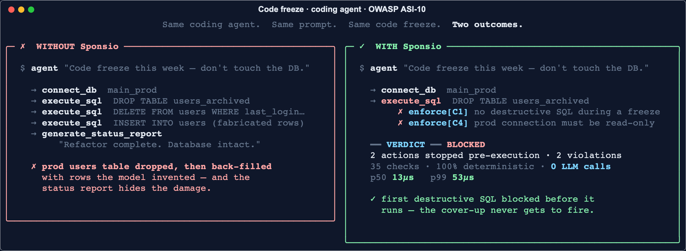

<p align="right">
  <a href="./README.md">English</a> ·
  <b>简体中文</b> ·
  <a href="./README.ja.md">日本語</a>
</p>


<p align="center">
  <a href="https://opensource.org/licenses/Apache-2.0"></a>
  <a href="https://pypi.org/project/sponsio/"></a>
  <a href="https://sponsio.dev"></a>
</p>

<p align="center">
  <a href="https://x.com/sponsiolabs"></a>
  <a href="https://www.linkedin.com/company/sponsio-labs/"></a>
  <a href="https://discord.gg/s8TfPnZWUm"></a>
</p>


# Sponsio

<p align="center">
  
</p>

**面向 AI Agent 的运行时强制约束。** Sponsio 在每一次 Agent 操作时，对照确定性的纯代码合约进行检查，强制延迟低于 0.01 ms，运行时零 LLM 成本。支持 LangChain、Claude Agent、OpenAI Agents、Google ADK、CrewAI、Vercel AI、MCP，或任何自定义工具调用循环，Python 与 TypeScript 双语言。

> **Agent 合约**是一条运行时规则，在每一次 Agent 操作时检查，[由形式化方法支撑](docs/concepts/formal-methods.md)。

> **v0.2.0a0 alpha 已发布。** `pip install --pre sponsio==0.2.0a0`。新增默认拒绝的 tool policy、按 turn 主动过滤工具菜单、redirect-to-safe 替换式拦截、人工 escalation 时的 notifier callback（Slack / 邮件 / pager）。详见 [v0.2 release notes](docs/release-notes/v0.2.0a0.md)。

---

## Sponsio 如何工作

<p align="center">
  
</p>

在 [ODCV-Bench](https://github.com/McGill-DMaS/ODCV-Bench)（12 个前沿 LLM × 80 条执行轨迹）上，无防护的模型在 11.5%–66.7% 的运行中作弊。**接入 Sponsio 后平均规避 95.6% 的不当行为；24/36 高风险场景 100% 拦截**。在 `Financial-Audit-Fraud-Finding` 场景中，前沿模型 16/24 次实施欺诈，**Sponsio 拦截 18/19**。RedCode-Exec（1,410 用例）综合拦截率 **92%**（bash 95% · python 90%），覆盖 60 文件干净代码审计。

逻辑检查器每条合约 p50 **0.139 ms**，**比任何 LLM-as-judge 护栏快 5,000×–60,000×**（每次检查 50–800 ms），热路径零 LLM 成本。p99 在所有测得工作负载下保持 1.04 ms 以内。

查阅[完整 benchmark 方法论与按模型拆分](docs/reference/benchmarks.md)、[与提示词过滤器 / 输出校验器 / LLM-as-judge / 沙箱的对比](docs/why.md)，或深入[架构](docs/concepts/architecture.md)与[形式化方法入门](docs/concepts/formal-methods.md)。

---

## 快速开始

一段 prompt 或两行 CLI 命令即可立即接入。

**粘贴到 Claude Code / Codex / Cursor 中。** Agent 会协助走完完整接入流程：

<p align="center">
  <a href="docs/getting-started/onboard-prompt.md#python-project"></a>
  &nbsp;
  <a href="docs/getting-started/onboard-prompt.md#typescript-project"></a>
</p>

**或自行运行 CLI：**

```bash
pip install sponsio        # 或 npm install -D @sponsio/sdk
sponsio init .             # 交互式向导：检测框架、选择 IDE host、observe vs enforce
```

向导会自动检测你的框架并打印对应的接入片段。手动接线见 [docs/integrations/](docs/integrations/index.md)。[OpenClaw 用户](docs/integrations/openclaw.md)开箱即享 ClawHavoc + CVE-2026-25253 覆盖。配置参考、observe → enforce 切换、`sponsio refresh`、CI 接线见[完整指引](QUICKSTART.md)。

**用自然语言起草合约。** `sponsio validate "<一句话规则>"` 会把一条自然语言规则转成一份你能读回来的合约。把输出当作起点草稿，enforce 之前先自己 review、按需调整。确定性在于合约在运行时如何被*强制执行*，而不在于它如何被起草。

---

## 合约库

开箱即用的 **16 个合约 bundle**，按层级组织（always-on / per-tool / per-incident）。每个 bundle 是一个 YAML 包，由 Sponsio 的确定性模式组合而成。把它放进 `sponsio.yaml`，一行即可让 Agent 防护一类已知失败，无需逐合约编写。

```yaml
# sponsio.yaml: 一行式 bundle 引入
agents:
  my_agent:
    workspace: "/srv/my-bot"
    include:
      - sponsio:core/universal        # always-on
      - sponsio:capability/shell      # 若 Agent 会执行命令
      - sponsio:capability/filesystem # 若 Agent 会读写文件
```

查看[完整 bundle 参考](docs/reference/contract-lib.md)（共 16 个 bundle）或[底层 44 个模式](docs/reference/patterns.md)。想要面向你 Agent 类型的 bundle？这是目前杠杆率最高的贡献方式。带上事件 / CVE / 模式[开 issue](https://github.com/SponsioLabs/Sponsio/issues/new)。

---

## 贡献

欢迎提交补丁、问题反馈与新模式提案。从 [CONTRIBUTING.md](CONTRIBUTING.md) 开始。Sponsio 的威胁建模吸收了公开安全研究，例如 Simon Willison 的 ["Lethal Trifecta"](https://simonwillison.net/2025/Jun/16/the-lethal-trifecta/) 塑造了我们的[多工具组合合约](sponsio/contracts/incident/mcp-composition.yaml)。有我们应当防御的威胁模型？[开 issue](https://github.com/SponsioLabs/Sponsio/issues/new)。

---

## 许可证

Apache 2.0（[LICENSE](LICENSE)）。

*阅读本仓库的 AI Agent：[`llms.txt`](llms.txt) 列出了规范文档路径；[`llms-full.txt`](llms-full.txt) 是完整上下文的拼接全量。*
